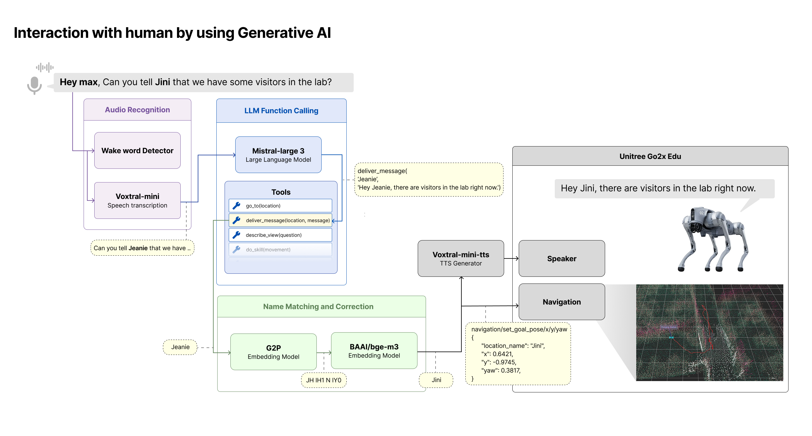
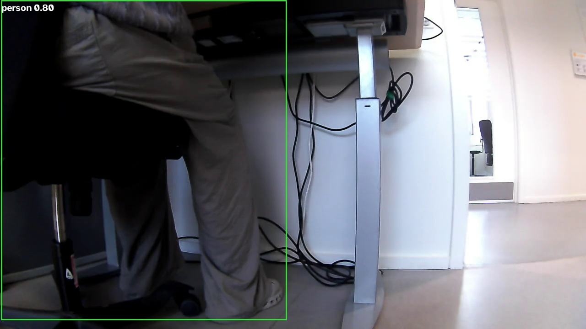
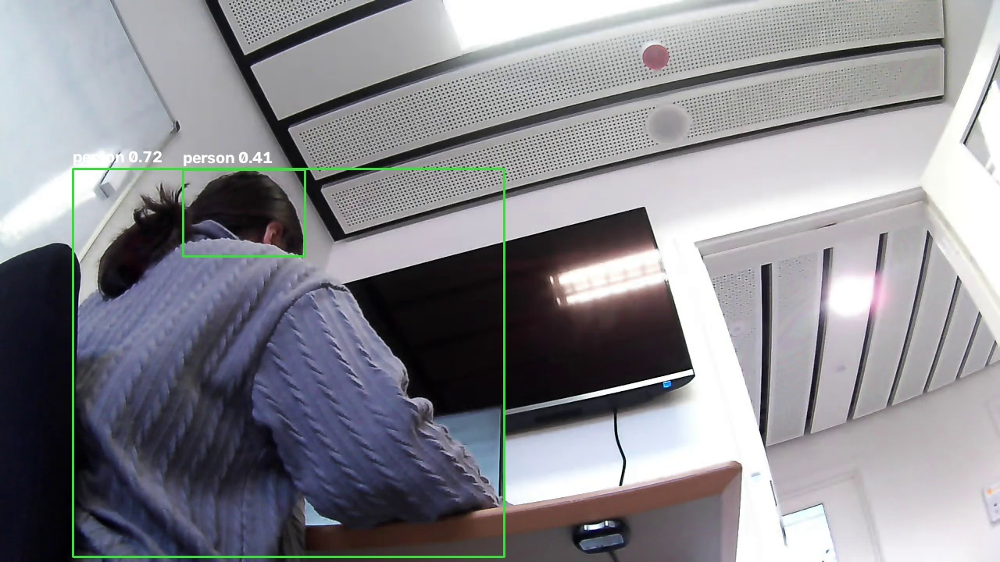

# `go2_assistant`: Unitree Go2 Speech Interaction System



`go2_assistant` is the main Python package for controlling a Unitree Go2 EDU robot dog through spoken or typed natural-language commands. After hearing "Hey Max", the robot can deliver a message to someone, navigate to a named location, request permission to enter a room, answer camera questions, inspect whether a seat is occupied, or perform expressive gestures.

This document is an internal technical reference for team discussion and maintenance. For repository-level setup and a shorter project overview, see the parent [project README](../../README.md).

> **External components used:** This assistant was developed with [unitree_ui](https://github.com/legion1581/unitree_ui) for map creation and management, and [unitree_webrtc_connect](https://github.com/legion1581/unitree_webrtc_connect) for the WebRTC connection to the robot.

<br><br>


## 1. System Capabilities

The package connects the following capabilities into a single interaction flow:

- Detects the `Hey Max` wake word from microphone input.
- Transcribes user speech into text.
- Uses an LLM to interpret intent and choose robot functions and arguments.
- Matches misspelled or misrecognized names to registered names based on pronunciation.
- Navigates using named coordinates stored on a LiDAR-SLAM map.
- Handles door entry by knocking, listening for permission, thanking the responder, and continuing navigation.
- Answers visual questions and checks whether a person is visible near a seat.
- Speaks through the robot speaker using generated TTS or pre-registered AudioHub records.
- Executes Unitree skills such as dancing, stretching, and making a finger heart.

<br><br>


## 2. End-to-End Flow

Example request:

```text
Hey Max, can you tell Jeanie that we have visitors in the lab?
```

```text
Microphone
  -> Wake-word detector: detects "Hey Max"
  -> Command recording
  -> STT: "tell Jeanie ..."
  -> Mistral LLM function calling
  -> deliver_message_to_person(person="Jeanie", message="...")
  -> Name matching
       "Jeanie" -> G2P phonemes -> BAAI/bge-m3 similarity -> "Jini"
  -> Map lookup
       "Jini" -> x, y, yaw in entire_office.json
  -> SLAM navigation
       navigation/start
       navigation/set_goal_pose/x/y/yaw
  -> Robot reaches the destination
  -> Voxtral TTS -> AudioHub upload/playback -> robot speaker
```

The LLM does not generate navigation coordinates itself. It calls tools such as `go_to` or `deliver_message_to_person`; coordinates come from `entire_office.json` after name matching.

<br><br>


## 3. Main Files and Responsibilities

| File or directory | Responsibility | Change it when... |
| --- | --- | --- |
| `app.py` | Creates services and manages startup/shutdown | Adding a service or changing the global execution order |
| `config.py` | Models, robot settings, audio, SLAM, door-entry, retry configuration | Changing thresholds, timing, models, or available skills |
| `state.py` | Shared runtime state: connection, pose, navigation state, audio state | Adding shared runtime state |
| `llm/prompts.py` | Max's behavioural and conversational rules | Changing emotional reactions, welcoming, or message delivery style |
| `llm/tool_schemas.py` | Tool contracts exposed to the LLM | Adding a new LLM-callable tool |
| `llm/assistant_loop.py` | LLM request and tool-call loop | Changing function-calling policy |
| `llm/assistant_actions.py` | Connects LLM tools to robot-facing services | Changing movement, delivery, skills, or seat-check behaviour |
| `services/input_service.py` | Microphone, wake word, recording, STT, text input | Changing microphones, recording rules, or STT |
| `services/name_matching_service.py` | G2P and embedding-based name correction | Changing name matching |
| `services/map_service.py` | Loads map ID and named poses | Changing map or named-location handling |
| `services/navigation_service.py` | Localization, SLAM commands, navigation state, retry logic | Adjusting `NO_PATH`, retries, corridor, or door routing |
| `services/door_entry_service.py` | Door approach, entry-permission listening, and post-permission navigation | Changing the knock/permission policy |
| `services/audio_service.py` | Generated TTS, AudioHub upload/playback/cleanup, audio tracks | Debugging or changing robot audio |
| `services/vision_service.py` | Receives WebRTC camera frames | Changing camera preview or image processing |
| `services/person_presence_service.py` | Captures two viewpoints and checks seat presence with YOLO/VLM | Changing the seat-presence decision |
| `Jini/entire_office.json` | Active map ID, initial pose, people, doors, and waypoint poses | Rebuilding a map or changing coordinates |

<br><br>


## 4. LLM Tools

The LLM can call the following tools:

| Tool | Input | Actual behaviour |
| --- | --- | --- |
| `go_to(location)` | Location or person name | Matches the name and navigates to its pose |
| `deliver_message_to_person(person, message, skill?)` | Recipient and message | Navigates to the recipient and speaks the message |
| `say_message(message, skill?)` | Spoken message | Speaks at the current location; can optionally execute a skill |
| `do_skill(skill)` | `Dance1`, `FingerHeart`, etc. | Executes a Unitree sport skill |
| `describe_view(question)` | Camera question | Sends the latest camera frame to Pixtral |
| `find_person(description)` | Person description | Checks whether any person is visible in the current camera view |
| `check_seat_and_report_back(person)` | Person name | Visits the seat, checks it, returns, and reports aloud |

<br><br>


### 4.1 Tool Inputs, Internal Flow, and User Commands

<br><br>


#### `go_to(location)`

**Purpose:** Navigate to a registered desk, door, corridor point, or demonstration point.

| Item | Details |
| --- | --- |
| LLM input | `location: string` |
| Name handling | Exact match first; otherwise G2P + embedding-based name matching |
| Robot action | Optional corridor waypoints -> `navigation/start` -> `navigation/set_goal_pose/x/y/yaw` |
| Success condition | `REACHED`, or the point-one close-enough exception |
| Main result | `status`, canonical `location`, current `x/y/yaw`, or `message` and `attempts` on failure |

Example user commands:

```text
Can you go to Jini's seat?
Go to Chen.
Please go to point one.
Can you go to the corridor?
```

`Jini's seat` is normalized and matched to the `Jini` pose in JSON. A name such as `point one` is handled as a registered location name, not as a numeric index into an arbitrary waypoint list.

<br><br>


#### `deliver_message_to_person(person, message, skill=None)`

**Purpose:** Travel to a person and deliver a message at that person's desk.

| Item | Details |
| --- | --- |
| LLM input | `person: string`, `message: string`, optional `skill: string` |
| Internal order | `go_to(person)` -> arrival confirmation -> `say_message(message, skill)` |
| Door handling | Door-entry flow can be inserted automatically for configured rooms |
| Main result | Canonical `target_person`, requested name, message, navigation result, and speech result |

Example user commands:

```text
Can you tell Jini that Martin is waiting in the office?
Please let Chen know that we have visitors in the lab.
Go to Dimitris and tell him the meeting is starting.
```

The LLM writes a short, natural spoken message addressed directly to the recipient. For example:

```python
deliver_message_to_person(
    person="Jini",
    message="Hey Jini, Martin is waiting for you in the office."
)
```

For delivery requests, the LLM considers the purpose and social context. Plain announcements are normally delivered without unnecessary gestures, while welcoming or greeting requests can include `Hello` or `FingerHeart`. For example, "welcome Jini" can result in navigation -> greeting -> welcome message -> finger heart.

<br><br>


#### `say_message(message, skill=None)`

**Purpose:** Speak without moving from the current position.

| Item | Details |
| --- | --- |
| LLM input | `message: string`, optional `skill: string` |
| Internal order | Optional skill -> Voxtral TTS -> AudioHub upload/playback |
| Main result | `spoken`, `message`, `skill`, and `skill_result` |

Example user commands:

```text
Say hello to everyone.
Can you say that the meeting will start in five minutes?
Tell us a short welcome message.
```

`say_message` is also used for emotional responses and guidance messages.

<br><br>


#### `do_skill(skill)`

**Purpose:** Execute a pre-existing Unitree motion or gesture.

| Item | Details |
| --- | --- |
| LLM input | `skill: string` |
| Robot interface | WebRTC `rt/api/sport/request` with a skill API ID |
| Main result | `status`, `skill`, or an API error code/message |

Available skills:

| Skill | Intended use |
| --- | --- |
| `Hello` | Greeting or welcoming |
| `Dance1` | Celebration, excitement, demonstration |
| `WiggleHips` | Playful cheering or light celebration |
| `FingerHeart` | Encouragement, warmth, welcoming |
| `Stretch` | Tiredness, stress, calming down |
| `Scrape` | Cute or playful reaction |
| `StandDown` | Resting, winding down, calming |
| `Sit` | When the user explicitly asks the robot to sit |
| `StandUp` | When the user asks it to stand, or to restore posture after vision |

Example user commands:

```text
Can you dance?
Please do a finger heart.
Can you stretch with me?
Sit down and get some rest.
Stand up, please.
```

<br><br>


#### `describe_view(question)`

**Purpose:** Answer a question about the latest front-camera image.

| Item | Details |
| --- | --- |
| LLM input | `question: string` |
| Internal action | Latest WebRTC frame -> JPEG data URL -> Pixtral query |
| Main result | `status`, `answer` |

Example user commands:

```text
What do you see in front of you?
Is there a chair in front of you?
Can you describe the room?
```

The visual prompt requires the model to answer only from the image. Identity and information outside the camera view are not guaranteed.

<br><br>


#### `find_person(description)`

**Purpose:** Check whether any person is visible in the current camera view. It detects presence only; it does not identify who the person is or navigate to a seat.

| Item | Details |
| --- | --- |
| LLM input | `description: string` |
| Internal action | Captures camera views at standing and seated heights, then resumes navigation. |
| Main result | `presence: present/absent/unknown`, reason, and saved image paths |

For normal user requests, `check_seat_and_report_back` is usually more appropriate. `find_person` is useful when the robot is already near the seat.

Example camera inputs captured at Jini's desk.

| Standing-height view | Sitting-height view |
| --- | --- |
|  |  |

<br><br>


#### `check_seat_and_report_back(person)`

**Purpose:** Visit a person's desk, inspect whether someone is visible, return to the saved starting location, and speak the result.

| Item | Details |
| --- | --- |
| LLM input | `person: string` |
| Internal order | Save current location -> `go_to(person)` -> `find_person` -> return -> `say_message` |
| Main result | `presence`, `report`, `go_result`, `find_result`, `return_result`, `say_result` |

Example user commands:

```text
Can you check whether Jini is at her seat?
Go to Chen's desk, see if he is there, and come back to tell me.
Is Dimitris at his desk? Please check and report back.
```

### 4.2 Automatic Behaviour That Is Not an LLM Tool

The following behaviours are not directly called by the user. They run inside `go_to` and `deliver_message_to_person` when their conditions are met.

| Internal behaviour | Trigger | Action |
| --- | --- | --- |
| Name correction | No exact location-name match | Finds the nearest registered name using G2P and embedding similarity |
| Corridor routing | Current and destination positions cross the configured corridor chain | Inserts required `b` and `d` intermediate points |
| Door approach | A target or route uses a `door...` location | Moves through `door..._waypoint1` before the door |
| Room-entry permission | Destination belongs to a configured room | Knocks, transcribes/classifies a reply, thanks the responder, then continues |
| Door reverse | A door waypoint is present after permission | Sends short wireless-controller inputs to move away from the door |
| Navigation retry | Navigation returns `NO_PATH`, `FAILURE`, or another configured failure state | Stops/starts navigation and retries up to five times |

<br><br>


## 5. Name Matching

Names are often misrecognized by speech-to-text, so the system does not rely only on direct string comparison.

```text
Input: "Jeanie"
  -> normalize_name_key
  -> g2p-en generates an ARPAbet phoneme sequence
  -> BAAI/bge-m3 creates an embedding
  -> cosine similarity against all registered-name embeddings
  -> returns the highest-scoring registered name: "Jini"
```

Registered names and poses come from `entire_office.json`. At startup, embeddings are precomputed for all named locations. Each request only needs to embed the new query.

Example log:

```text
[NameMatch] query='Ginny' g2p='JH IH1 N IY0' best='jini' score=0.9401 gap=0.1815
```

- `score`: similarity to the best candidate.
- `gap`: score difference between the best and second-best candidates. A small gap means ambiguous matching is more likely.

The current implementation always returns the nearest candidate rather than rejecting low-confidence matches. If many similar names are added, introduce score/gap thresholds and ask the user for confirmation.

<br><br>


## 6. Navigation and Maps

<br><br>


### Map Data

`Jini/entire_office.json` contains:

- `map.id`: Unitree SLAM map ID to activate on the robot.
- The first pose: initial pose used when starting localization.
- Remaining poses: people, doors, corridor points, and demonstration points with `x`, `y`, and `yaw`.

Example:

```json
{
  "kind": "Jini",
  "x": 0.642174,
  "y": -0.974567,
  "yaw": 0.381728347622125
}
```

<br><br>


### Map Creation, Storage, and Code Integration

Maps are created and managed through the included UI based on [legion1581/unitree_ui](https://github.com/legion1581/unitree_ui). The UI communicates with the robot mapping server. `entire_office.json` is not the map itself; it stores the map ID and named poses used by language commands.

```text
Create a map in unitree_ui
  -> robot: mapping/start
  -> move the robot while it builds a LiDAR map
  -> Stop & Save
  -> robot: mapping/stop
  -> UI creates a map ID and sends common/set_map_id/<id>
  -> UI stores map.pcd, map.pgm, and map.txt from the robot slot in browser local cache
  -> Export a ZIP map bundle for backup

Run go2_assistant
  -> load map.id and named poses from Jini/entire_office.json
  -> robot: common/set_map_id/<map.id>
  -> localization/set_initial_pose/<initial pose>
  -> use named poses for navigation/set_goal_pose/<x>/<y>/<yaw>
```

Keep the exported ZIP when a map is created. To reuse a map on another computer or in a new browser session, use `Import .zip` and Load it. The UI uploads `map.pcd`, `map.pgm`, and `map.txt` back to the robot, then sends `common/set_map_id/<id>`.

Sending only `common/set_map_id` changes the map label; it does not restore the map files. If the robot slot does not contain the same PCD/PGM/TXT bundle, localization or navigation can fail even when the map ID appears correct. When creating or loading a different map, update the `map.id`, initial pose, and every waypoint in `entire_office.json` together.

<br><br>


### SLAM Commands Sent to the Robot

The navigation service publishes these string commands to the Unitree LiDAR mapping server over the WebRTC data channel:

```text
common/set_map_id/<map_id>
localization/set_initial_pose/<x>/<y>/<yaw>
localization/start
navigation/start
navigation/set_goal_pose/<x>/<y>/<yaw>
navigation/stop
```

A successful `navigation/set_goal_pose` log means that the robot accepted the command, not that it reached the destination. Real success requires:

```text
[SLAM Nav State] REACHED
```

Failure states include `NO_PATH`, `FAILURE`, `TIMEOUT`, `GOAL_OCCUPIED`, and `ABNORMAL`. General navigation retries up to five times. `point one` is a special case: if it ends in `NO_PATH` or `FAILURE` within 0.30 m of its goal, it is treated as reached.

<br><br>


### Door-Entry Flow

For a destination in a registered room beyond a door:

```text
door waypoint1 -> door -> "Knock knock, can I come in?"
-> record/transcribe reply at the door
-> classify as allowed / denied / unclear
-> allowed: play "Thank you" -> move away from door -> navigate to destination
```

When the robot creates a final path immediately after knocking at a pose very close to the door or wall, the planner may fail to find a route. After permission is granted, the implementation therefore sends a short wireless-controller movement away from the door before restarting navigation.

Door waypoints and the reverse movement are highly sensitive to map alignment and robot state. The reverse action is not planned distance control; it repeats joystick wireless-controller messages for a fixed duration.

<br><br>


## 7. Audio and TTS

Generated audio was initially played directly through WebRTC streaming. Playback omissions, clipped starts, and noise were observed, so generated speech was changed to an AudioHub upload-and-playback flow. Even with this method, the start of generated speech can occasionally be clipped; a short leading silence is prepended to generated WAV files.

<br><br>


### Input

`InputService` uses the default microphone selected by `sounddevice`.

- Sample rate: 16 kHz
- Wake-word model: `Jini/hey_max.onnx`
- STT: `voxtral-mini-latest`
- Maximum recording after wake-word detection: 8 seconds
- End-of-speech rule: configured period of silence

Connecting a Bluetooth microphone is not enough by itself. If Windows still selects the laptop microphone as the default input device, the laptop microphone is used.

<br><br>


### Output

Normal replies follow this path:

```text
LLM final reply or say_message
  -> Voxtral TTS generation: voxtral-mini-tts-2603
  -> WAV generation and optional leading silence
  -> Upload to Unitree AudioHub
  -> Find the new AudioHub record UUID
  -> Call play_audio and wait for playback state
  -> Remove the uploaded record and temporary WAV
```

The door prompts "Knock knock" and "Thank you" are pre-registered AudioHub UUIDs, not newly generated TTS each time.

<br><br>


## 8. Vision and Seat Inspection

<br><br>


### `describe_view`

The latest WebRTC camera frame is converted into a JPEG data URL and sent to `pixtral-12b-latest` with the user's question. It is used for questions about visible objects and scenes.

<br><br>


## 9. Skills and Emotional Interaction

The available skills are defined in `config.py`:

```text
Sit, StandUp, StandDown, Hello, Stretch,
Dance1, WiggleHips, FingerHeart, Scrape
```

`AssistantActions.do_skill()` sends the corresponding Unitree skill API ID to the WebRTC request topic `rt/api/sport/request`.

The system prompt contains these demo-oriented preferences:

- Tired or stressed: prefer `Stretch`, `FingerHeart`, and `StandDown`.
- Nervous or anxious: prefer `Stretch`, `FingerHeart`, and optionally `Scrape`.
- Birthday, happiness, celebration: prefer `Dance1`, `WiggleHips`, and `FingerHeart`.
- Welcome: use `Hello`, a spoken welcome, and `FingerHeart`.
- For multiple actions, prefer speech -> action -> speech -> action.

Skill selection is driven by LLM function calling and `SYSTEM_PROMPT`, not a fixed if/else table. Similar requests may therefore produce different but contextually appropriate skill sequences.

<br><br>


## 10. Running Modes

| Mode | Description |
| --- | --- |
| Voice mode | Listens for the wake word, then receives a spoken command. |
| Text mode (`--text`) | Receives typed commands instead of microphone input. |
| No-robot mode (`--no-robot`) | Tests LLM tool selection without connecting to the robot. |
| Log mode (`--log`) | Prints detailed processing, navigation, audio, and tool logs. |

### 10.1 Utility Scripts

The `tools/` directory contains standalone development and maintenance scripts. The camera and AudioHub tools require a local checkout of [unitree_webrtc_connect](https://github.com/legion1581/unitree_webrtc_connect) and a connection to the robot.

| Script | Purpose | Example |
| --- | --- | --- |
| `generate_knock_tts.py` | Generates `tts/knock_knock.wav` using the configured Mistral TTS voice. | `python tools/generate_knock_tts.py` |
| `go2_yolo_person_chair.py` | Opens the Go2 front-camera stream, runs YOLO, and displays `person` and `chair` detections. Press `Q` to close the preview. | `python tools/go2_yolo_person_chair.py --robot-ip 192.168.88.154` |
| `list_audio.py` | Lists AudioHub files on the robot and provides an interactive prompt to upload or delete audio records. | `python tools/list_audio.py` |

`generate_knock_tts.py` needs `MISTRAL_API_KEY`. The other two scripts must only be used when it is safe to connect to the robot and operate its camera or audio library.

<br><br>


## 11. Issues Observed During Extended Operation

The issues below were observed during demonstrations. Some depend on the Unitree SLAM or AudioHub internal state, so they are not all proven to be caused by this code alone.

<br><br>


### 11.1 TTS Reports Success but No Sound Is Heard

Example log:

```text
[TTS] Ready, uploading to AudioHub...
[AudioHub] Waiting for uuid ... playback state...
[AudioHub] Started uuid ...
[AudioHub] Done
```

This confirms that AudioHub reported playback state. It does not prove that audible sound reached the physical speaker.

Possible causes:

- An outgoing WebRTC audio track or robot audio channel becomes unstable during extended operation.
- AudioHub record-list updates are delayed after upload, so a new UUID is missed or selected incorrectly.
- Playback-state messages are delayed or missing.
- Robot speaker channel, volume, network, or internal resource contention after navigation/skills.

Current mitigations:

- Generated TTS uses AudioHub upload/playback.
- The audio list is compared before and after upload to find the new UUID.
- The first audio-list record is used as a fallback if name matching fails.
- Uploaded records and temporary WAV files are removed after playback.
- Wake-word listening pauses during TTS to reduce self-triggering.

Potential improvements:

- Validate playback through a more reliable device-level or loopback signal.
- Periodically health-check and reconnect the audio channel/outgoing track during long runs.
- Add explicit retry/status reporting when UUID discovery or playback fails.
- Use pre-uploaded AudioHub UUIDs for key demo lines to reduce variability.

<br><br>


### 11.2 Robot Stops After Entry Permission

Observed sequence:

```text
[Door] Reply='Sure, come in.' permission=allowed
[Door] Entry allowed; starting post-permission navigation
[SLAM] navigation/set_goal_pose/...
[SLAM Nav State] TRACKING
```

In this case, permission recognition and the thank-you prompt succeeded. The following navigation either did not lead to physical motion, remained in `TRACKING`, or ended with `NO_PATH`/`FAILURE`.

Possible causes:

- The door pose is too close to a wall or obstacle for the planner.
- The physical robot position and localized map pose disagree near the door.
- A previous navigation/localization session is still active.
- Robot orientation and map yaw differ, so the reverse/avoidance action is not executed as intended.
- The door, threshold, people, bags, or furniture temporarily block the local planner.

Current mitigations:

- Door approach points such as `door210_waypoint1 -> door210` can be used.
- A short joystick-controller reverse is attempted after permission, then navigation restarts.
- Failed navigation retries up to five times.
- Logs report `WAITING`, `TRACKING`, `REACHED`, `NO_PATH`, and `FAILURE`.

The joystick reverse uses repeated `ly` inputs. Its direction and distance can vary with robot orientation, controller-axis semantics, and joystick-control state, so it is not a guaranteed solution.

<br><br>


### 11.3 `NO_PATH` Increases After Multiple Trips

The most likely causes are localization drift or map mismatch, not LLM reasoning.

- Walking for a long time or slipping can move the estimated pose away from the real pose.
- The map ID can look correct while PCD, PGM, metadata, and saved poses come from different map versions.
- Uploading a new map while keeping old `entire_office.json` coordinates can produce valid-looking but unusable goals.
- `navigation/set_goal_pose` success means command acceptance, not successful path planning.

Operational checks:

- Restart localization if the UI pose visibly differs from the robot's real position.
- If several targets fail with `NO_PATH`, check the map ID and complete map file bundle first.
- If only one target fails, check whether its coordinate is close to a wall, table, or inflated obstacle.
- The point-one 0.30 m close-enough exception applies only when it reaches the target area before `NO_PATH` or `FAILURE`.

<br><br>


#### 11.3.1 Temporary Recovery After Rest

During demonstrations, after navigation became unstable, a pause of about five minutes did not resolve the issue, while a pause of about fifteen minutes was followed by normal operation in at least one observed case. This may be related to increased sensor noise from temperature, recovery of internal SLAM/localization state, or a temporary network/service condition.

The current logs do not prove that heat causes sensor noise. To isolate the cause, repeat tests using the same initial pose, map, target coordinates, and indoor environment while recording failure time, rest duration, and robot/sensor temperature when available. For demonstrations, waiting approximately fifteen minutes, then rechecking localization and navigation state, is a safer temporary response than retrying immediately after only five minutes.

<br><br>


### 11.4 Wake Word or Commands Are Occasionally Missed

Intermittent wake-word and command-recognition misses were observed during demonstrations. The cause has not been isolated; microphone selection is only one possible factor.

<br><br>


### 11.5 Mistral API 503

`Status 503: Service unavailable` is normally a temporary provider-side error rather than a local logic error. The current request can terminate immediately, so a robust demonstration build should add exponential-backoff retries for chat, STT, VLM, and TTS requests.

<br><br>


## 12. Reading Logs

| Prefix | Meaning | What to inspect |
| --- | --- | --- |
| `[Queued]` | A text command entered the queue | Text input worker |
| `[User]` | Final text sent to the LLM | Whether STT produced the intended request |
| `[Tool]` | LLM-selected function and arguments | Whether the LLM chose the correct tool |
| `[NameMatch]` | Pronunciation-based matching result | `best`, `score`, and `gap` |
| `[SLAM]` | Pose, commands, retry, movement result | Map ID, current pose, target |
| `[SLAM Nav State]` | Navigation state reported by the robot | Final `REACHED` or failure state |
| `[Door]` | Door approach, reply, permission | Navigation state after `permission=allowed` |
| `[AudioHub]` | Upload, UUID lookup, playback state | UUID discovery and `Started`/`Done` |
| `[TTS]` | Generated-speech stage | Whether generation or upload stopped |
| `[find_person]` | Seat-check progress | YOLO hint count and final VLM presence result |

When diagnosing a failure, run with `--log` and preserve one complete block from user command to final state. A single `navigation/set_goal_pose/success` line is not enough to explain the real outcome.

<br><br>


## 13. Team Improvement Topics

1. **Extended-operation reliability:** Define health checks and automatic recovery for WebRTC, AudioHub, microphone, and SLAM services.
2. **Navigation reliability:** Version map files and poses together; block stale waypoints after a map change.
3. **Name-matching safety:** Add score/gap thresholds and confirmation questions such as "Did you mean Jini?"
4. **Canonical names in speech:** Decide whether message text should replace a misrecognized recipient name with the matched canonical name.
5. **Audio verification:** Find a more reliable playback-success signal than AudioHub `Started`/`Done`.
6. **API recovery:** Add retry, fallback responses, and user feedback for Mistral 429, 503, and timeout failures.
7. **Test separation:** Keep independent tests for STT, LLM tool calling, TTS/AudioHub, and SLAM navigation, plus integration scenarios.
8. **Safety policy:** Define movement checks, emergency-stop procedures, and speed/area limits for shared spaces.

<br><br>


## 14. Models and External Components

| Role | Current component |
| --- | --- |
| Wake word | Custom `hey_max.onnx` via [OpenWakeWord](https://github.com/dscripka/openWakeWord) |
| Speech transcription | `voxtral-mini-latest` |
| LLM function calling | `mistral-large-latest` |
| Vision-language model | `pixtral-12b-latest` |
| TTS | `voxtral-mini-tts-2603` |
| Name embedding | `BAAI/bge-m3` |
| Grapheme-to-phoneme | `g2p-en` |
| Person/chair detection | Ultralytics `yolov8n.pt` |
| Map management UI | [legion1581/unitree_ui](https://github.com/legion1581/unitree_ui) |
| Robot connection | [legion1581/unitree_webrtc_connect](https://github.com/legion1581/unitree_webrtc_connect) |

The `-latest` names are provider aliases rather than fixed model versions. Record the actual execution date and resolved model version when reporting experiments.

<br><br>


## 15. Pre-Demo Checklist

- Confirm `MISTRAL_API_KEY` and `UNITREE_ROBOT_IP` in `.env`.
- Confirm that the robot and laptop are on the same network.
- Confirm that Windows selects the intended default microphone.
- Confirm that the UI and `entire_office.json` reference the same map ID.
- Place the robot in clear space near the initial pose.
- Confirm in the UI that localization matches the robot's real location.
- Keep people, bags, chairs, and other obstacles away from doorways and planned paths.
- Use `--log` to preserve AudioHub, SLAM, and NameMatch logs.
- Prepare a manual control or emergency-stop method.
